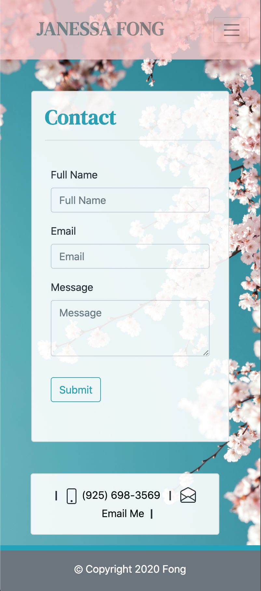
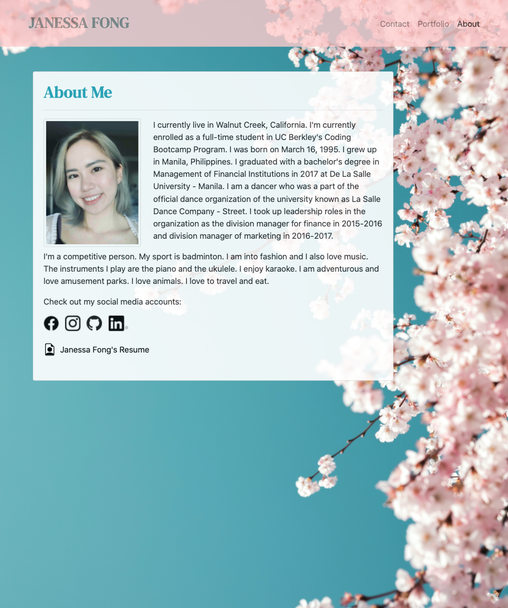
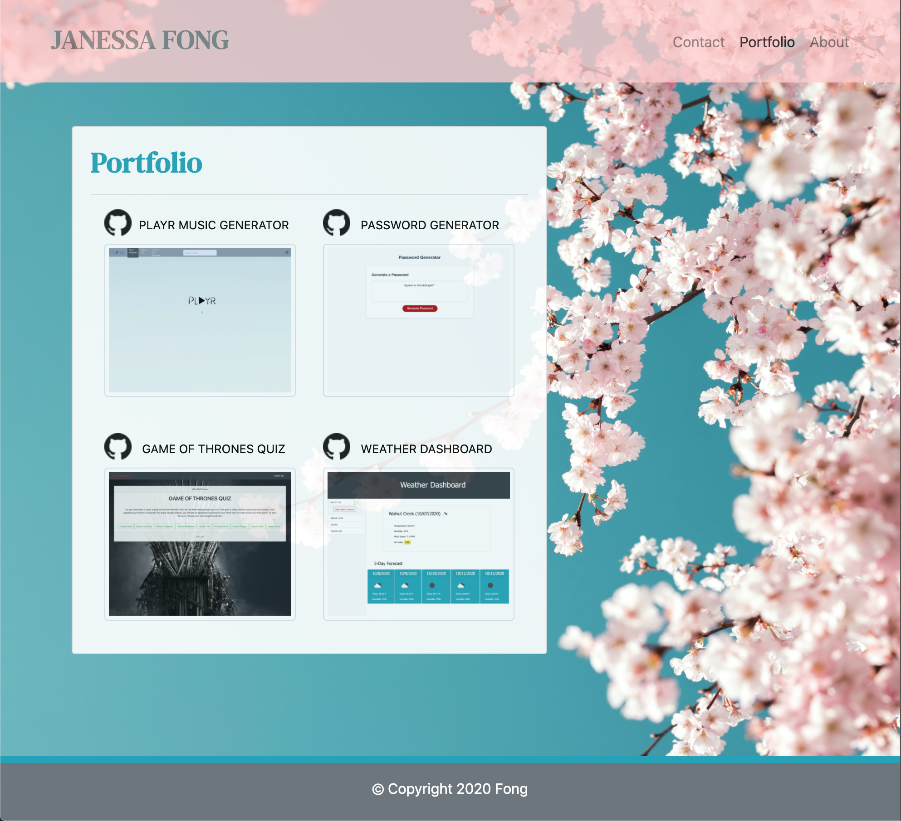

# My Portfolio

In this project, I've created a functional and responsive portfolio utilizing the Bootstrap CSS Framework as well as utilizing the Bootstrap grid system so that the website and its layouts function on different devices and browsers. This project is all about consistency and functionality. 

This project was a great way to add personality to your own portfolio for future collaborations and to showcase projects. It's a great way to witness and document the journey in becoming a master coder but for now, I am still a master coder in training and this is a way to see the process unfold and my growth in this program. This is a gateway to the real world, in this case, the tech world to prepare each one of us and push us to move forward and pave the way into our careers.

Challenges I've faced, I did spend a lot of time working on the sticky footer and this was a great challenge because I tried to not have it fixed on the screen but stick to the bottom of the scrolling page. Although it's not seen in my HTML files but I did slightly achieve the sticky footer but at a certain scale of the screen, it moved up but in every other scale size, it worked almost flawlessly but because of that one screen size, I've decided to stick with the current fixed footer that I have coded in. And the Bootstrap grid system was also challenging at first but it took analysis, experimentation and some research to successfully to achieve the layout design.

The requirements of this project include the following:

* Consistent navbar on each of the required working links:
    * About
    * Portfolio
    * Contact

* Main content 
    * Biography
    * Portfolio containing projects (to be updated)
    * Contact information form

* Usage of HTML semantic elements
* A sticky footer
* A responsive layout and images
* Validate each page using a validation service
* A functional and deployed application
* GitHub repository with descriptive README file
* Personal Information in the About Page
* Proper usage of Bootstrap components and grid system
* Screenshots of website in different screen sizes (see photos below)

## Table of Contents

* [Features](#features)
* [Technologies Used](#technologies-used)
* [GIF of Project](#gif-of-project)
* [Images of Project](#images-of-project)
* [Deployed Link](#deployed-link)
* [Authors](#authors)
* [License](#license)

## Features

This project has a number of features including:

* A navbar with functional links

    In this navbar, you need to be aware of the detail of keeping your links active if you're on that current page. Adding color to my name as a sort of emphasis of my portfolio.

* Main content

    * About Me

        In the about page, adding a card title as your base while utilizing the bootstrap grid system and attaching an image, a short paragraph about myself and links to my social media accounts and in this case, I utilized the logos that will direct you to my social media accounts.

    * Portfolio
    
        In this portfolio page, although still no projects added in. I've added a placeholder image and placeholder links that may lead to the specific project's deployed link or to the github repository pertaining to that project.

    * Contact

        In this page, this was built again in a card title and added a form to be filled out by anyone who would like to reach out.

    * A sticky footer

        This feature was a tricky one. I did attempt a sticky footer and it worked except at a certain screen size moved a little bit away from the bottom of the page so I have attempted instead to use the fixed feature. 

## Technologies Used

* [HTML](https://developer.mozilla.org/en-US/docs/Web/HTML)
* [Bootstrap](https://getbootstrap.com/)

## GIF of Project

## Images of Project

Attached below are screenshots in their screen sizes 400px, 768px, and 992px, respectively.

## Code Snippet

In this code snippet, although the requirements were to add social media links, I've decided to do a different and not too difficult approach but I utilized the social media logos abiding with their guidelines that will directly link to my accounts and open up in a new tab. I liked the simplicity of the black logos just so that it aesthetically workes well with my portfolio. 

## Deployed Link

* [See Live Site](https://janessaref.github.io/my-portfolio/)

## Authors

* Janessa Reeanne Fong

- [Link to Github](https://github.com/janessaref)
- [Link to LinkedIn](https://www.linkedin.com/in/janessafong)

## License

This project is licensed under the MIT License 